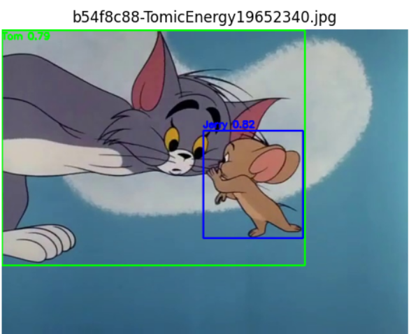
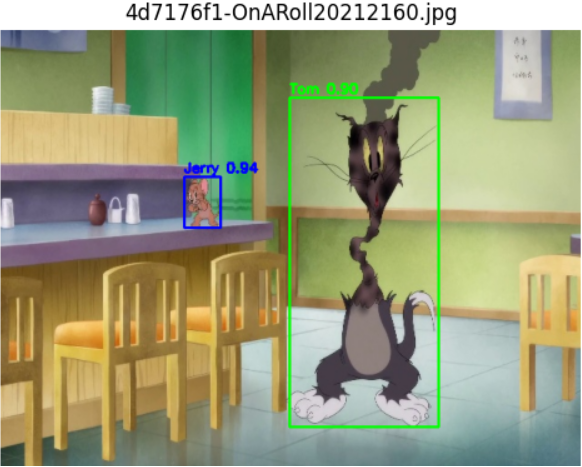
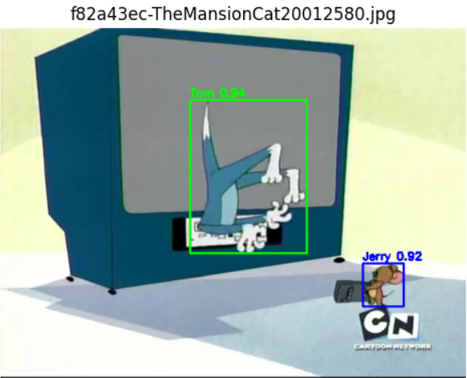
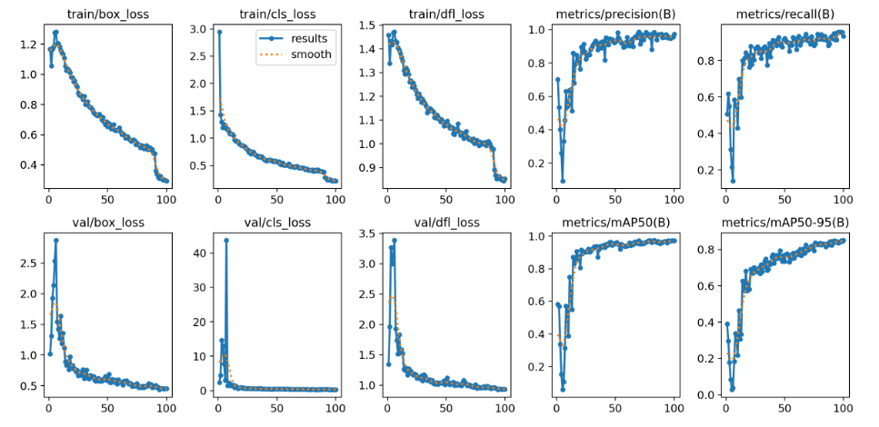

# Tom & Jerry Detection (YOLOv8 Toy Project)

> A lightweight toy project for detecting **Tom** and **Jerry** in images using **YOLO (Ultralytics YOLOv8)**.

## Overview
This repository demonstrates a minimal end-to-end object detection pipeline:
- **Data**: custom-labeled images of Tom & Jerry
- **Model**: YOLOv8 (Ultralytics)
- **Tasks**: train → validate → inference → visualization
- **Goal**: build a clean, reproducible baseline and visualize prediction quality

Competition Description: https://www.kaggle.com/competitions/tom-jerry-object-detection/overview

Kaggle Notebook: https://www.kaggle.com/code/yukuanzou/yolo-detection

**Why YOLO?**  
YOLO (You Only Look Once) is a one-stage object detector that predicts bounding boxes and class probabilities in a single forward pass, making it fast and practical for real-time or near real-time detection.

---

## Features
- ✅ Train YOLOv8 on a small custom dataset (Tom/Jerry)
- ✅ Run inference on images
- ✅ Visualize predicted bounding boxes + confidence scores
- ✅ Export results for inspection (optional: CSV/JSON)

---

## Demo
> Detection on the test set samples.

  

  

  

---

## Method

This project implements a simple object detection pipeline using **YOLOv8**.  
The workflow includes dataset preparation, model training, inference, and visualization.

### 1. Dataset Preparation

The dataset annotations are converted into the **YOLO format** required by Ultralytics.

### 2. Training and Validation

- Training is performed using the Ultralytics API.
- Evaluation metrics such as mAP (mean Average Precision) are automatically computed by YOLO.

  

### 3. Post-processing

During inference, YOLO may occasionally produce nested bounding boxes where a large box overlaps with a smaller one of the same class.

To reduce redundant detections, a simple post-processing rule is applied:

- If a larger box fully contains a smaller box of the same class
- and the smaller box has a higher confidence score

the larger box is removed.

This helps keep the most precise detections.

---

## Visualization

Each detected object is displayed with:

- a bounding box

- the predicted class label

- the confidence score

This allows qualitative inspection of detection performance.

---

## Leaderboard Result

| Model | Public Score(40%) | Private Score(60%) |
|------|-------------|--------------|
| YOLOv8s | 0.80735 | 0.83258 |
| Deep Learning Dynamos (benchmark) | 0.80232 | 0.81971 |

---

## Acknowledgement

This project uses the YOLO implementation from:

Ultralytics YOLO
https://github.com/ultralytics/ultralytics
